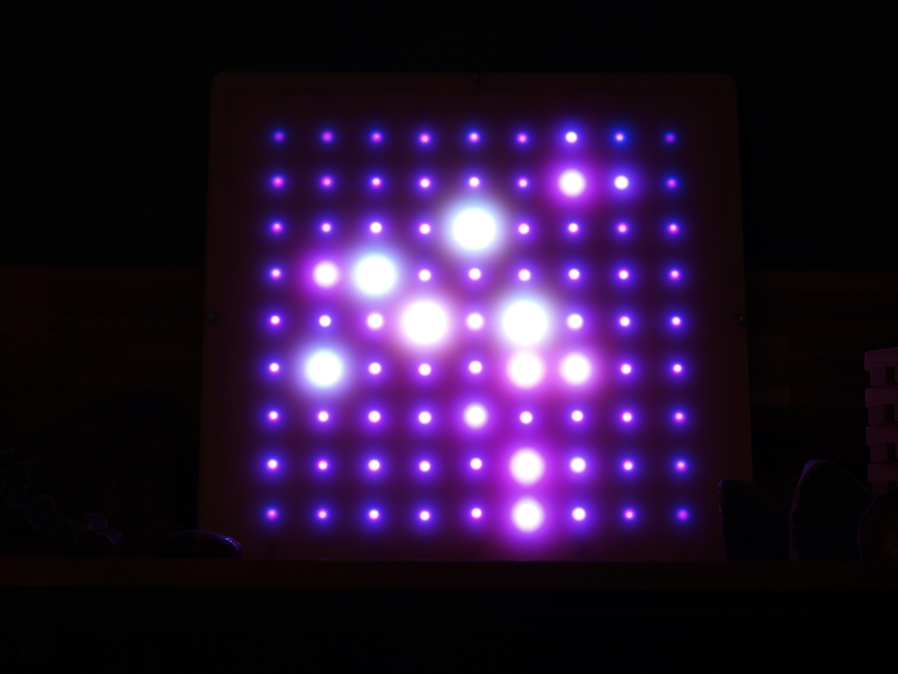

# Movingcity

A code repository for all animations, configs and other stuffs that has to do with my fadecandy artproject.

Moving City is a programmable 9x9 RGB LED matrix made using Fadecandy as pixel controller and a Raspberry Pi Zero as server  for incoming websocket connections and for controling the animations running on the matrix.

## Setting up your PI

### BerryLan:

Uses [BerryLan](https://github.com/nymea/berrylan) for quick and easy network setup.

Flash the BerryLan image on an SD card using Balena Etcher.

When you boot your Pi, you can now use the BerryLan app to set up your network settings using bluetooth.

### Fadecandy

After the network has been set up you can see the IP adress of your pi in the BerryLan app. SSH to this address and use the standard login details to log in (pi/Raspberry)

Follow the fadecandy server setup over at 
[adafruit.com](https://learn.adafruit.com/1500-neopixel-led-curtain-with-raspberry-pi-fadecandy/fadecandy-server-setup)

When you're done with the setup you can use the serverconfig.json file provided in this repository as config for the server. This file explains to the fadecandy controller how the led strips are connected to the board. 
You need to change the serial number to your own fadecandy serial number. You can find this when you go the webpage running the server (http://ipadress:7890) or you can see it in the serverlogs when you connect a Fadecandy board.

### Other things

-   Change your password by typing  `sudo passwd` in the terminal
-   Set rasbian to CLI and,
-   Enter the command `sudo raspi-config` . Scroll down to Boot Options and select Console Autologin. Then exit the configuration menu and reboot.

### Known problems and some links:

Fadecandy disconnects, maybe non clean power

https://github.com/scanlime/fadecandy/issues/112

How to test for clean power

https://forum.arduino.cc/index.php?topic=476877.0

Pi accesspoint

https://www.raspberrypi.org/documentation/configuration/wireless/access-point.md

Patch to use FadeCandy board with TouchDesigner

https://github.com/Heljick/FCDesigner

Use TouchOSC to control animations?

https://hexler.net/products/touchosc
https://www.npmjs.com/package/node-osc

